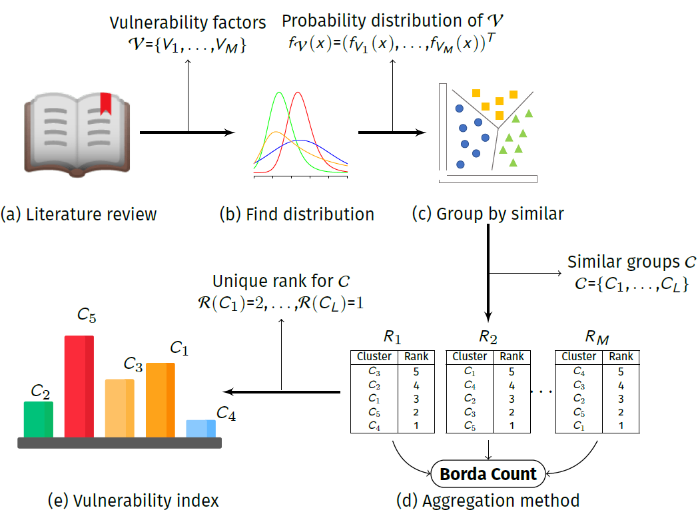

# UVA
**Urban Vulnerability Assessment for Pandemic Surveillance: 
The COVID-19 case in Bogotá, Colombia.**

Here, an Urban Vulnerability Assessment (UVA) methodology is proposed. UVA investigates various vulnerability factors related to pandemics (severity of infection and transmissibility) to assess the vulnerability in urban areas. A vulnerability index is constructed by the aggregation of multiple vulnerability factors computed on each urban area (i.e., urban density, poverty index, informal labor, transmission routes). This methodology is useful in a-priori evaluation and development of policies and programs aimed at reducing disaster risk (DRR) at different scales (i.e., addressing urban vulnerability at national, regional, and provincial scales), under diverse scenarios of resources scarcity (i.e., short and long-term actions), and for different audiences (i.e., the general public, policy-makers, international organizations). The applicability of UVA is shown by the identification of high vulnerable areas based on publicly available data where surveillance should be prioritized in the COVID-19 pandemic in Bogotá, Colombia. 
  
[](https://journals.plos.org/plosone/article?id=10.1371/journal.pone.0245787)

## Directories
- Technical report : explains the methodology used for the modeling. 

## Copyright
The Copyright of the UVA belongs to the ALIFE research groups at 
Universidad Nacional de Colombia. 
You are free to use the INFEKTA for research purposes. 
All publications which use this model or any code in the model should acknowledge the use of **INFEKTA** and reference
_"Prieto, J., Malagón, R., Gomez, J., & León, E. (2021). 
Urban Vulnerability Assessment for Pandemic Surveillance: The COVID-19 Case in Bogotá, Colombia. 
Sustainability, 13(6), 3402."_.

```
@article{prieto2021urban,
  title={Urban Vulnerability Assessment for Pandemic Surveillance—The COVID-19 Case in Bogot{\'a}, Colombia},
  author={Prieto, Jeisson and Malag{\'o}n, Rafael and Gomez, Jonatan and Le{\'o}n, Elizabeth},
  journal={Sustainability},
  volume={13},
  number={6},
  pages={3402},
  year={2021},
  publisher={Multidisciplinary Digital Publishing Institute}
}
```  